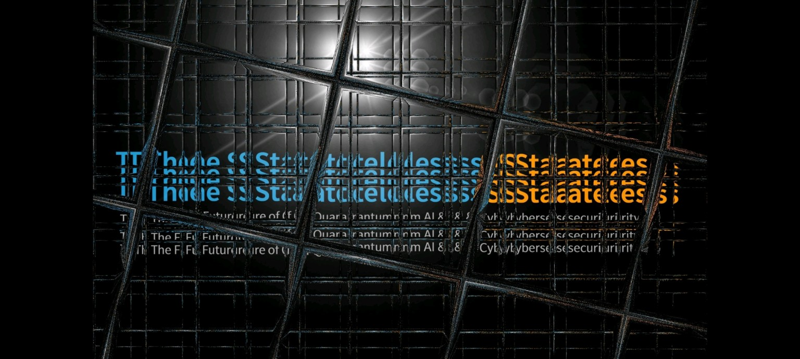
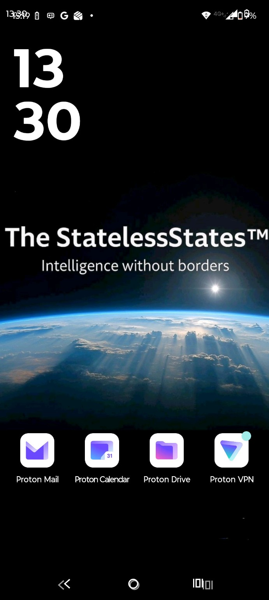
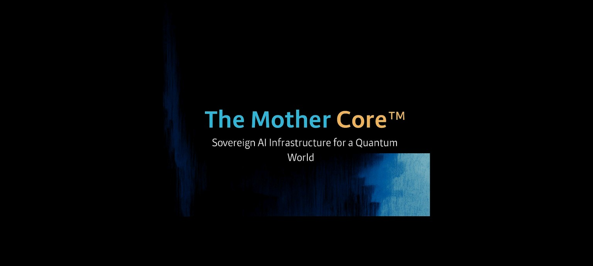
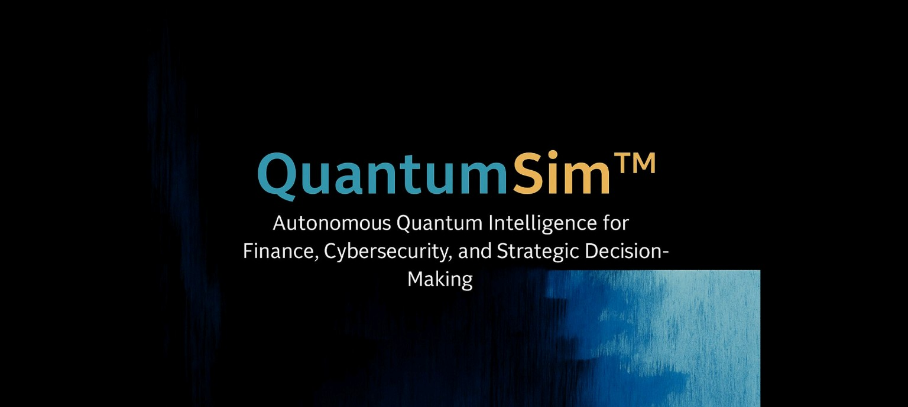
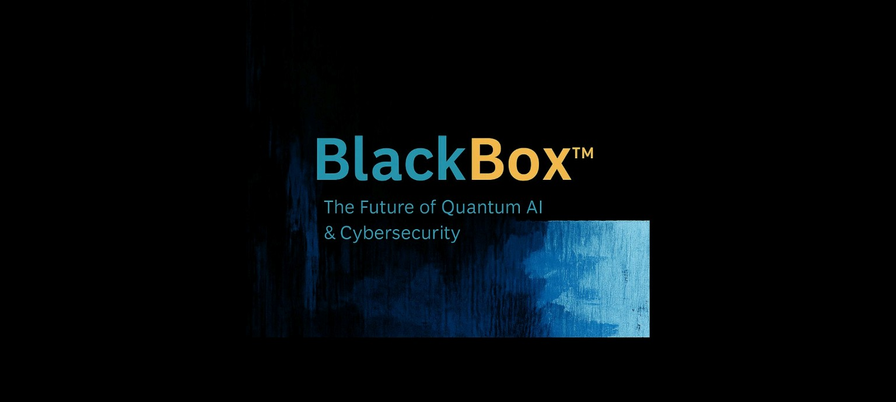
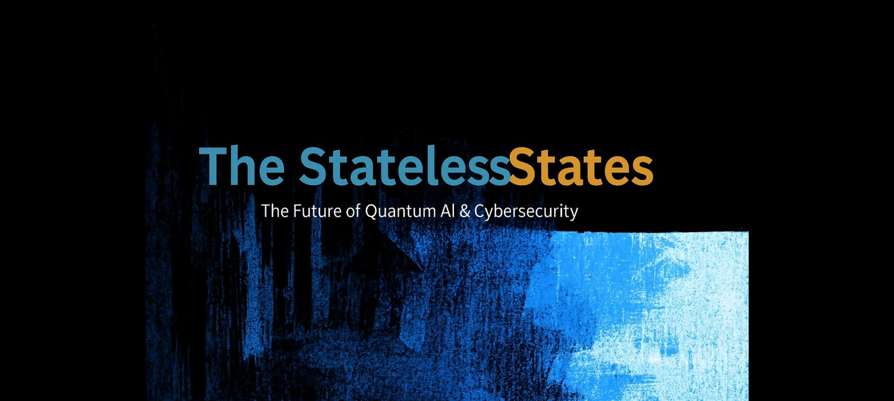
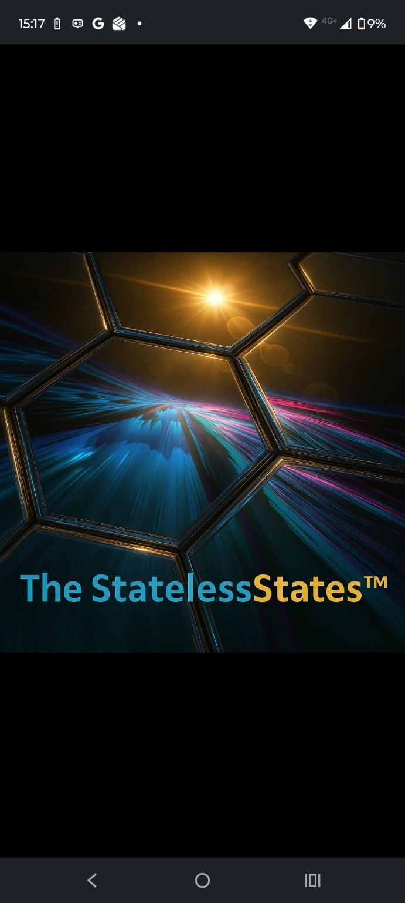

# Genesis Systems International

## The StatelessStates™

Advanced software systems for defence and national security.

The StatelessStates™ is part of the Genesis Systems International research and systems architecture portfolio, exploring resilient software architectures, autonomous systems, cybersecurity, simulation, and human-controlled intelligent infrastructure.

## Core Concepts

### The Mother Core™

A conceptual systems architecture representing the central intelligence and coordination layer within the Genesis systems environment.

### BlackBox™

A controlled systems environment concerned with opaque, uncertain, and adversarial computational behaviour.

### QuantumSim™

A simulation environment for exploring quantum and advanced computational concepts within the wider Genesis research architecture.

### The StatelessStates™

A conceptual environment for resilient, autonomous and adaptive systems operating beyond conventional stateful assumptions.

## Visual Archive

The repository contains a visual archive of Genesis Systems concepts and system interfaces.

### Genesis Systems

### The StatelessStates

### System Architecture

### BlackBox / Simulation

### Mother Core

### Additional Systems Visualisation

### StatelessStates Visualisation

## Related Genesis Work

The wider Genesis Systems portfolio includes:

- **The Order**
- **TRINITY**
- **Agentics-30**
- **Chaos Architect**
- **AECL — Autonomous Ephemeral Communication Layer**
- **MEDUSA**
- **Farseer**
- **The StatelessStates**

These projects explore different aspects of resilient infrastructure, autonomous systems, cybersecurity, simulation, information systems and human-controlled AI architectures.

## Status

Public concept and visual archive.

The repository is intended to document the Genesis Systems International architecture, concepts and development direction while keeping implementation details and restricted work separate.

---

**Genesis Systems International Ltd © 2026**
